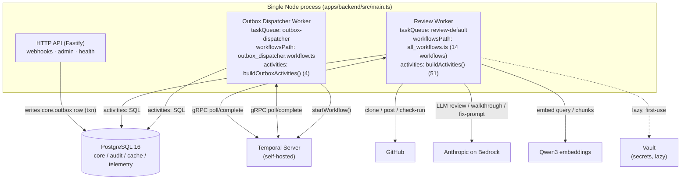
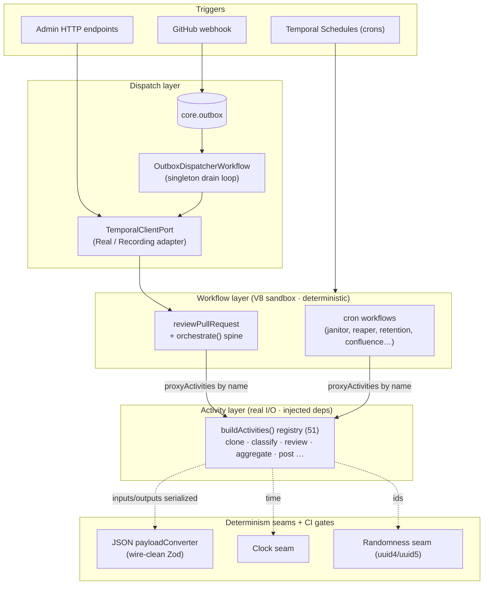
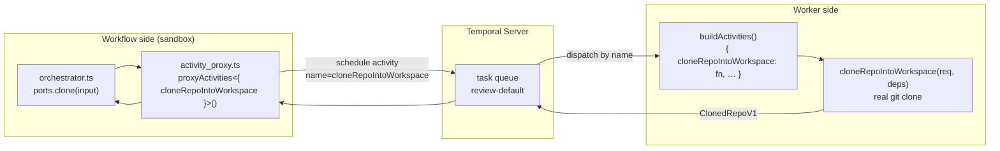
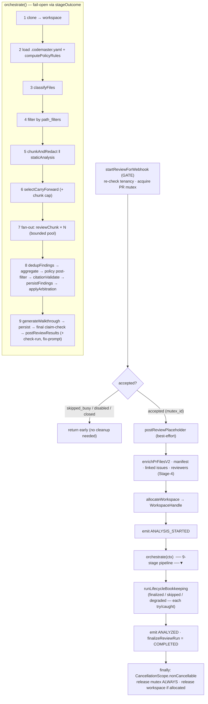
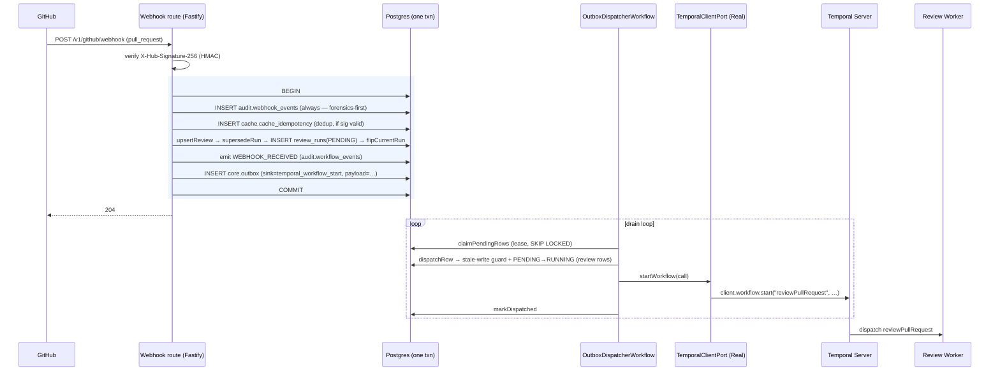
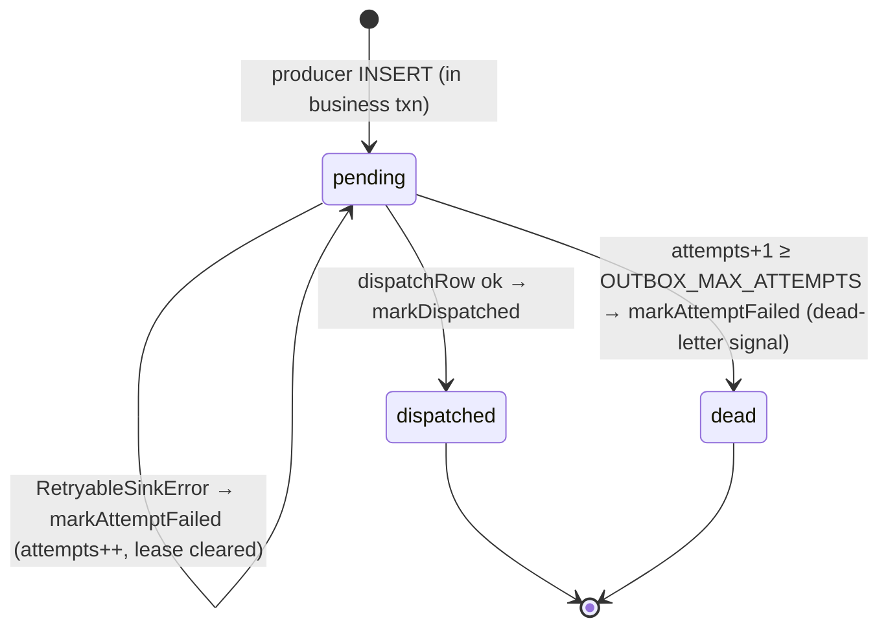

# Temporal Integration Architecture — codemaster-backend

> **Status:** Living reference · **Last updated:** 2026-06-09
> **Audience:** Any engineer working on `codemaster-backend` who needs to understand how Temporal workflows, activities, orchestration, dispatch, and schedules fit together — end to end.
> **Scope:** The TypeScript backend (`@temporalio/*` SDK, Fastify, Kysely, Zod v4, Node 22 ESM). It is a faithful 1:1 port of the frozen Python/Temporal codebase, so the *patterns* mirror Python idioms but are expressed in TS.
> **Source of truth:** the code. Every section cites `file:line` anchors you can open. If this doc and the code disagree, the code wins — and please fix the doc.

---

## Table of contents

1. [The mental model in one paragraph](#1-the-mental-model-in-one-paragraph)
2. [System topology](#2-system-topology)
3. [The layered model](#3-the-layered-model)
4. [Layer 1 — Workflows (the orchestrators)](#4-layer-1--workflows-the-orchestrators)
5. [Layer 2 — Activities (the functions that do the work)](#5-layer-2--activities-the-functions-that-do-the-work)
6. [The wiring seam — how workflows and activities connect](#6-the-wiring-seam--how-workflows-and-activities-connect)
7. [Retry & timeout policy](#7-retry--timeout-policy)
8. [The review orchestration spine](#8-the-review-orchestration-spine)
9. [Starting & signalling workflows — the outbox pattern](#9-starting--signalling-workflows--the-outbox-pattern)
10. [The outbox dispatcher in depth](#10-the-outbox-dispatcher-in-depth)
11. [Determinism & replay-safety seams](#11-determinism--replay-safety-seams)
12. [Schedules & crons](#12-schedules--crons)
13. [End-to-end worked example](#13-end-to-end-worked-example)
14. [Failure modes & operational behavior](#14-failure-modes--operational-behavior)
15. [Reference: complete workflow inventory](#15-reference-complete-workflow-inventory)
16. [Reference: complete activity registry](#16-reference-complete-activity-registry)
17. [How to extend the system](#17-how-to-extend-the-system)
18. [Glossary, ADR index & file map](#18-glossary-adr-index--file-map)

---

## 1. The mental model in one paragraph

**Workflows orchestrate, activities do the work, and the two are welded together by a registered-name contract.** A workflow is an exported async function that runs inside a deterministic V8 sandbox; it declares the activities it needs with `proxyActivities<{ name(input): Promise<T> }>(...)` and calls them like ordinary functions. A single **composition root** (`buildActivities()`) constructs a same-named function for each activity with all its real dependencies (DB pools, LLM clients, GitHub clients) pre-injected, and hands that registry to the Temporal Worker. Everything that touches a clock, a socket, a database, randomness, or a secret lives in an **activity**; the workflow body is pure orchestration. Work is *triggered* not by calling Temporal directly but by writing a row to a **transactional outbox** (`core.outbox`) in the same database transaction as the business state; a singleton **dispatcher workflow** drains that table and starts the real workflows through a **client port**. Three cross-cutting **seams** (a JSON payload converter over wire-clean Zod contracts, a clock seam, and a randomness seam) plus CI gates guarantee replay-safety.

```
HTTP / webhook ─▶ core.outbox (same txn) ─▶ OutboxDispatcherWorkflow ─▶ TemporalClientPort.startWorkflow
                                                                                 │
                                                                 ┌───────────────▼───────────────┐
                                                                 │  reviewPullRequest (sandbox)   │  ← workflow: orchestration only
                                                                 │   gate │ mutex │ workspace     │
                                                                 │   orchestrate() 9-stage spine  │
                                                                 │   ports.clone/classify/review… │  ← proxyActivities, called by NAME
                                                                 └───────────────┬───────────────┘
                                                                                 │ Temporal dispatches by registered name
                                                                 ┌───────────────▼───────────────┐
                                                                 │ buildActivities() registry     │  ← activities: real work, deps injected
                                                                 │ clone │ classify │ review …    │     one Zod input, ApplicationFailure on error
                                                                 └────────────────────────────────┘
   seams underneath everything:  dataConverter (wire-clean Zod) · Clock · Random · collapse-on gates · CI replay gates
```

---

## 2. System topology

One **combined process** (`apps/backend/src/main.ts:16`) boots the HTTP API and **two independent Temporal Workers** concurrently under `Promise.all([...])`, and is fail-loud: if either worker rejects, the process exits so Kubernetes restarts it.



| Worker | Entrypoint | Task queue | Workflow bundle | Activities |
|---|---|---|---|---|
| **Review pipeline** | `worker/main.ts` | `review-default` (env `TEMPORAL_TASK_QUEUE`) | `workflows/all_workflows.ts` (14 workflows) | `buildActivities()` — 51 |
| **Outbox dispatcher** | `worker/outbox_dispatcher_main.ts` | `outbox-dispatcher` (env `CODEMASTER_OUTBOX_TASK_QUEUE`) | `workflows/outbox_dispatcher.workflow.ts` (1) | `buildOutboxActivities()` — 4 |

**Why two workers, one pod (the "combined-pod" topology, ADR-0075).** Temporal binds exactly one `workflowsPath` bundle per Worker. The dispatcher needs its own bundle (only the dispatcher workflow), so it's a second `Worker` instance — but it runs in the *same* OS process as the review worker and the API. There is no separate "ingest", "confluence-sync", or "embedder" pod: all 14 review-side workflows (the review pipeline + reconcile + every cron) register on the one review worker.

**Production-misconfiguration guard.** `resolveWorkerTemporalConfig` (`worker/temporal_config.ts:38`) refuses to boot against a real cluster (non-loopback address or `NODE_ENV=production`) unless `TEMPORAL_NAMESPACE` and `TEMPORAL_TASK_QUEUE` are both set explicitly — otherwise the dualrun-isolated defaults would silently poll the wrong queue and process zero reviews. Producers resolve the *same* queue via `resolveReviewTaskQueue()` (`temporal_config.ts:65`) so a producer can never diverge from the queue the worker polls.

---

## 3. The layered model

Reading top to bottom: a trigger enters, an outbox row is written, the dispatcher starts a workflow, the workflow orchestrates activities, activities do real work, and everything is serialized through the determinism seams.



The rest of the document walks each layer in depth.

---

## 4. Layer 1 — Workflows (the orchestrators)

### 4.1 What a workflow is

A workflow is an **exported async function**. Its exported name *is* the Temporal workflow type. The review worker registers them by pointing `workflowsPath` at a barrel that re-exports every workflow function (`workflows/all_workflows.ts:37`):

```ts
export { reviewPullRequest } from "./review_pull_request.workflow.js";
export { reconcileInstallation, reconcileRepositories, repairInstallationRepositories } from "./reconcile.workflow.js";
export { mutexJanitorWorkflow } from "./mutex_janitor.workflow.js";
// …11 more
```

Workflows range from a one-line pass-through to the 1,100-line review spine:

```ts
// workflows/mutex_janitor.workflow.ts:27 — the minimal shape
export async function mutexJanitorWorkflow(): Promise<MutexJanitorResultV1> {
  const { mutex_janitor_activity } = proxyActivities<{
    mutex_janitor_activity(): Promise<MutexJanitorResultV1>;
  }>(toActivityOptions(RETRY_POLICIES.mutexJanitor));
  return mutex_janitor_activity();
}
```

### 4.2 Declaring activities — `proxyActivities`

Inside a workflow, the only way to *do* anything is to call an activity through a proxy. The review pipeline uses **one `proxyActivities` call per activity** so each keeps its own retry curve (`workflows/activity_proxy.ts:151`):

```ts
const { cloneRepoIntoWorkspace } = proxyActivities<{
  cloneRepoIntoWorkspace(input: CloneRepoIntoWorkspaceInput): Promise<ClonedRepoV1>;
}>(toActivityOptions(RETRY_POLICIES.clone));   // 60s start-to-close, 30s heartbeat, max 3 attempts
```

The method key in the generic (`cloneRepoIntoWorkspace`) **must exactly match the name the worker registered** — see [§6](#6-the-wiring-seam--how-workflows-and-activities-connect). `activity_proxy.ts` assembles 18 such proxies into a single typed `ReviewActivityPorts` object with short aliases (`clone`, `classify`, `reviewChunk`) that the orchestrator calls.

### 4.3 Determinism — what a workflow may and may not do

A workflow module is bundled into the Temporal **V8 isolate**, which bans `node:crypto`, raw clocks, raw RNG, sockets, and the filesystem. A workflow therefore imports **only** `@temporalio/workflow` + `@temporalio/common`, the deterministic orchestrator helpers, and **type-only** contract shapes (erased at compile under `verbatimModuleSyntax`, so no runtime edge to crypto-importing contract modules is created) (`review_pull_request.workflow.ts:53`).

- **Time:** never `Date.now()` / `new Date()`. The workflow reads `workflowInfo().startTime` (replay-deterministic) and threads it as an RFC3339 string where an activity needs "now" (`review_pull_request.workflow.ts:756`).
- **Timers:** never `setTimeout`. Use the SDK's `sleep()`.
- **IDs:** no random UUIDs in the workflow body; deterministic identity comes from the SDK (`workflowInfo()`), and content-addressable IDs use `uuid5` inside activities.
- **Signals/queries:** **none are defined** anywhere. The system is fully outbox/activity-driven; the knowledge-approval "signal" is an admin-port concept (see [§9.3](#93-the-admin-temporal-port)), not a workflow `setHandler`.

### 4.4 Resource lifecycle & cancellation

The review workflow brackets its body in a non-cancellable cleanup scope so the PR mutex and workspace lease are **always** released — even if Temporal cancels the workflow mid-flight (`review_pull_request.workflow.ts:825`):

```ts
} finally {
  await CancellationScope.nonCancellable(async () => {
    await releasePrReviewMutexActivity(mutexId);              // ALWAYS — a leaked mutex blocks future reviews
    if (workspaceHandle !== null) await releaseWorkspace(...); // only if allocated
  });
}
```

The outer catch distinguishes a Temporal cancellation from an error via `isCancellation(err)` and flips the run to `CANCELLED` vs `FAILED` accordingly (`:866`).

### 4.5 The "collapse-on gates" idiom

The frozen Python used 25 `workflow.patched("…")` version markers to evolve workflow logic safely across deploys. Because the TypeScript workflows are a **brand-new workflow type with zero pre-existing histories**, every gate collapses unconditionally to its "true" branch and is written as straight-line code — there is **no** runtime `workflow.patched()` call anywhere. The ledger at `review/pipeline/gates.ts:57` records all 25 collapsed gates (with `coupledGroup` links for gates that must be ported together) so nobody re-introduces dead legacy branching.

> 📌 **Why this matters for you:** if you add a *new* breaking behavior to an existing workflow that already has histories in production, you cannot just collapse it — you must gate it with `workflow.patched()` and follow the three-deploy retirement lifecycle. The "collapse" shortcut is a one-time privilege of the greenfield port.

The full list of all 14 review-side workflows + the dispatcher is in [§15](#15-reference-complete-workflow-inventory).

---

## 5. Layer 2 — Activities (the functions that do the work)

### 5.1 The single-input contract (ADR-0047 / invariant 11)

**Every activity takes exactly one positional argument, typed as a Zod contract, and validates it at the boundary.** This is the most important activity rule. It makes inputs forward-evolvable (versioned contracts) and gives a single parse point:

```ts
// activities/classify_files.activity.ts:133
export async function classifyFiles(input: ClassifyFilesInputV1): Promise<FileRoutingV1> {
  const parsed = ClassifyFilesInputV1.parse(input);   // defense-in-depth, even though the wire is validated
  return doClassify({ /* … */ });
}
```

Where the Python had a two-positional activity (e.g. `classify_files(workspace_path, files)`), the port introduces a single **envelope contract** (`ClassifyFilesInputV1` with both fields) to close the violation (`libs/contracts/src/classify_files.v1.ts:24`). Spine contracts use Zod `.strict()` (reject unknown keys); outbox contracts use the default `.strip()` to match the Python `extra='ignore'` semantics.

### 5.2 Four implementation forms

| Form | When used | Example | Note |
|---|---|---|---|
| **Plain async function** | stateless work, deps resolved from env inside the body | `classifyFiles` | most common (27 activities) |
| **Holder-class method (arrow property)** | needs injected collaborators (embedder, LLM cache, GitHub client) | `AggregateFindingsActivity.aggregateFindings` | 18 activities; arrow property keeps `this` bound when destructured into the registry map |
| **Curried 2-arg** | a function `(input, deps)` whose deps are baked in at registration | `cloneRepoIntoWorkspace` | the registry wraps it to a genuine 1-arg function |
| **Self-defaulting 2-arg** | `(input, deps = default)` — optional 2nd param | `allocateWorkspace` | `fn.length === 1`, registered bare |

```ts
// Holder class — arrow property so `this.embedder` survives destructuring (activities/aggregate_findings.activity.ts:122)
export class AggregateFindingsActivity {
  public constructor(private readonly embedder: EmbeddingsPort) {}
  public readonly aggregateFindings = async (input: AggregateFindingsInputV1): Promise<AggregatedFindingsV1> => { /* … */ };
}
```

### 5.3 Dependency injection — the composition root

Activities are stateless to Temporal, so dependencies are injected **once** at worker boot by `buildActivities()` (`worker/build_activities.ts:691`). It:

1. Requires `CODEMASTER_PG_CORE_DSN`, builds the embedder (`resolveEmbeddingsConsumer()`), the ledger-wired LLM cache (ADR-0068), GitHub clients, and Postgres pools (ADR-0062).
2. **Curries 2-arg activities to 1-arg** so Temporal's single-positional dispatch is satisfied:
   ```ts
   cloneRepoIntoWorkspace: async (req) => cloneRepoIntoWorkspace(req, await resolveClonerDeps()),
   ```
3. Builds dependencies that need **secrets lazily** — the "deferred-Vault" pattern. `makeLazyLlmClientCache` / `makeClonerDepsResolver` memoize on first dispatch, so boot never blocks on Vault and a dev environment with no Confluence configured never crashes on a missing token (`build_activities.ts:501`).

### 5.4 Error handling

Activities throw `ApplicationFailure.create({ message, type, nonRetryable })`; Temporal routes retryability by the `nonRetryable` flag (`review/review_activity.ts:156`):

```ts
if (e instanceof BedrockBudgetExceededError) {
  throw ApplicationFailure.create({ message: e.message, type: "BedrockBudgetExceededError", nonRetryable: true });  // fail immediately
}
```

Domain errors (`CloneFailedError`, `LlmOutputUnsafeError`) are caught and wrapped where useful; the per-activity `nonRetryableErrorTypes` list (see [§7](#7-retry--timeout-policy)) names the error types that must *not* be retried (e.g. `StaleWriteError`, `PrClosedError`).

The full registry of all 51 activities is in [§16](#16-reference-complete-activity-registry).

---

## 6. The wiring seam — how workflows and activities connect

This is the heart of the integration. There are **two halves that meet at a string name.**



- **Worker side** (`buildActivities()`): returns `Record<string, (input) => Promise<unknown>>` consumed by `Worker.create({ activities })`. The **map key** is the registered name.
- **Workflow side** (`proxyActivities<{ name(...) }>()`): the **method key** must equal the registered name. `activity_proxy.ts` wraps 18 proxies into `ReviewActivityPorts` with short aliases (`clone`, `classify`, `reviewChunk`) for the orchestrator's readability — the long name is the dispatch identity, the short alias is local sugar.

```ts
// worker/main.ts:79 — registration
const worker = await Worker.create({
  connection, namespace: temporal.namespace, taskQueue: temporal.taskQueue,
  workflowsPath: require_.resolve("../workflows/all_workflows"),
  activities,                                                        // ← buildActivities() registry
  dataConverter: { payloadConverterPath: require_.resolve("./data_converter") },
});
```

> Note the `createRequire(import.meta.url)` bridge: the package is ESM (`"type": "module"`), but Temporal's `workflowsPath` / `payloadConverterPath` need absolute CJS-resolvable paths, so the code resolves them via `require_.resolve(...)`.

### Two failure classes — and the gate that prevents both

1. **Name mismatch** → `ActivityNotRegistered` at runtime (the proxy schedules a name the worker never registered).
2. **A bare 2-arg function** registered without currying → `deps` is `undefined` when Temporal dispatches a single positional arg.

Both are caught **before runtime** by a source-derived completeness gate (`test/unit/worker/build_activities.test.ts:265`):

```ts
it("registers EVERY activity the workflow proxies (no drift)", () => {
  expect(PROXIED_ACTIVITY_NAMES.length).toBeGreaterThanOrEqual(30);  // regex-parsed from the workflow source
  const registered = new Set(Object.keys(buildActivities()));
  expect(PROXIED_ACTIVITY_NAMES.filter((n) => !registered.has(n))).toEqual([]);
});
it("every registered value is a 1-arg activity (the 2-arg-crash guard)", () => {
  for (const v of Object.values(buildActivities())) expect(v.length).toBeLessThanOrEqual(1);
});
```

The gate **parses `proxyActivities<{…}>` calls out of the workflow source files** (no hand-maintained list to drift) and asserts every proxied name is registered and every registered value has arity ≤ 1.

---

## 7. Retry & timeout policy

Each proxy is configured from a per-activity `RETRY_POLICIES` constant (`review/pipeline/activity_ports.ts:175`), adapted to the SDK's `ActivityOptions` by `toActivityOptions()` (`activity_proxy.ts:98`). When a field is omitted, the SDK default applies (`backoffCoefficient` 2.0; `maximumInterval` 100× `initialInterval`; `initialInterval` 1s).

| Activity port | start→close | heartbeat | sched→close | initial | max interval | backoff | max attempts | non-retryable types |
|---|---|---|---|---|---|---|---|---|
| **clone** | 60s | 30s | — | 2s | — | — | 3 | — |
| loadRepoConfig | 10s | — | — | 2s | — | — | 1 | — |
| computePolicyRules | 5s | — | — | 2s | — | — | 1 | — |
| classify | 30s | — | — | 2s | — | — | 3 | — |
| chunkAndRedact | 30s | — | — | 2s | — | — | 3 | — |
| staticAnalysis | 120s | — | — | 2s | — | — | 2 | — |
| selectCarryForward | 30s | — | — | 2s | — | — | 3 | — |
| embedQuery | 15s | — | — | 2s | 15s | 2.0 | 3 | — |
| retrieveKnowledge | 20s | — | — | 2s | 20s | 2.0 | 3 | — |
| **reviewChunk** | 90s | — | — | 5s | 60s | 2.0 | 4 | BedrockBudgetExceededError, BedrockOutputUnsafeError, BedrockInvalidRequestError |
| dedupFindings | 30s | — | — | 2s | — | — | 3 | — |
| persistReviewFindings | 30s | — | — | 2s | — | — | 3 | StaleWriteError |
| aggregate | 30s | — | — | 2s | — | — | 3 | — |
| generateWalkthrough | 60s | — | — | 5s | — | — | 2 | LlmAuthError, LlmRoleNotConfiguredError, LlmRoleDisabledError |
| persistReviewWalkthrough | 30s | — | — | (SDK 1s) | — | — | 3 | — |
| postReview | 60s | — | — | 2s | — | — | 3 | PrClosedError, PostReviewPermissionError, StaleWriteError |
| postCheckRun | 30s | — | — | 2s | — | — | 3 | GitHubForbiddenError † |
| cleanup | 30s | — | — | 2s | — | — | 2 | — |
| citationValidate | 30s | — | — | 2s | — | — | 3 | — |
| emitOutputSafetyAudit | — | — | **2 min** | 1s | 30s | — | 5 | — |
| recordDelivery{Finalized,Skipped,Degraded} | 30s | — | — | 1s | — | 2.0 | 3 | — |
| buildRetrievedEvidence | 15s | — | — | 2s | — | — | 3 | — |
| updatePrDescriptionSummary | 30s | — | — | 2s | — | — | 2 | — |
| applyArbitration | 30s | — | — | 2s | — | — | 3 | StaleWriteError |
| recordToolRuns | 30s | — | — | 2s | — | — | 3 | — |
| generateFixPrompt | 60s | — | — | (SDK 1s) | — | — | 3 | — |
| allocateWorkspace | 30s | — | — | 2s | — | — | 3 | — |
| recordReviewLifecycleEvent | 30s | — | — | 2s | — | — | 3 | ValueError |
| finalizeReviewRun / recordRunTerminal | 30s | — | — | 2s | — | — | 3 | StateDrift, ValueError |

Key design points:
- **clone** is the only activity with a `heartbeatTimeout` (long git downloads send heartbeats; the clone activity also calls `heartbeat()` to keep its workspace lease fresh).
- **reviewChunk** (the LLM call) gets the most generous budget (90s × 4 attempts) but treats budget/safety/invalid-request errors as terminal.
- **emitOutputSafetyAudit** is the only activity using `scheduleToCloseTimeout` with an **independent 5-attempt budget**, so a failing audit emit never re-triggers the upstream (expensive) LLM call.
- **Data-integrity guards** (`StaleWriteError`, `StateDrift`) are always non-retryable — retrying a stale write would corrupt run-causality.

> † `postCheckRun`'s `GitHubForbiddenError` non-retryable type is a deliberate divergence from the frozen Python (which retries): fail fast on a permanent permission gap instead of burning 3 attempts.

---

## 8. The review orchestration spine

`reviewPullRequest` is the showcase of how a workflow *orchestrates*. The workflow body owns resource lifecycle (gate → mutex → placeholder → workspace → cleanup → terminal bookkeeping) and delegates the actual analysis to a pure helper, `orchestrate(ctx)` (`review/pipeline/orchestrator.ts`), which can be unit-tested with no Temporal context at all.



### 8.1 Two patterns that define the spine

**1. `stageOutcome` — fail-open with degradation notes.** Every soft stage is wrapped (`review/pipeline/degradation.ts:193`): on error it logs WARN, emits `record_stage(error)` (a replay-safe metric via the Temporal metric meter), appends a deduplicated note to `state.degradation`, and **swallows the error** so the stage degrades the review instead of killing the workflow. Only `reviewChunk` and policy-compute pass `raiseAfterLog: true` to surface a first-error; **cancellation is always re-raised** regardless. The accumulated notes flow into the walkthrough (rendered *after* all degradation-producing stages) and into the `ANALYZED` event, so the published review honestly reflects degraded state.

**2. Bounded chunk fan-out.** `fanOutReview` (`review/pipeline/parallelism.ts:125`) is a worker-pool over a shared monotonic cursor with **index-keyed result slots** (so results assemble in input order, not completion order — required for replay determinism) and a cooperative `aborted` flag for first-error peer cancellation. Each chunk runs `bedrockReviewChunk` as its own activity, wrapped in `stageOutcome(raiseAfterLog)`.

### 8.2 The claim-check seam

A renewal-backed lease check (`claimCheck` callback) is dispatched at **four** boundaries: before clone, before classify, before aggregate, and immediately before post. A lost lease raises a non-retryable `ApplicationFailure`, aborting the review **before** any GitHub spend — so a superseded review can never post over a newer one (`orchestrator.ts`, FIX #10 at the pre-post check).

### 8.3 Context threading & per-chunk build

`ReviewPipelineContext` threads `runId` / `reviewId` / `repositoryId` (in its `pr` field) into every dispatch. `buildChunkContext` (`orchestrator.ts:929`) builds each chunk's `ReviewContextV1`: it looks up the policy bundle for the path, embeds the query once per unique path (cached in `state.queryVectorCache`, keyed by `chunk.path`), retrieves knowledge (fail-open), and threads tier-1 / tool-status context. The post stage populates `state.postedReview` (via `captureFromPostedReview`), which the workflow body reads afterwards to do finding-delivery lifecycle bookkeeping — each setter individually try/caught, because the review is already posted and a bookkeeping failure must never fail the workflow.

---

## 9. Starting & signalling workflows — the outbox pattern

Workflows are **not** started directly from the webhook handler. Instead the system uses a **transactional outbox**: business state and the "please start a workflow" intent are written in the *same* database transaction, so workflow dispatch is durable and decoupled from Temporal's availability.



### 9.1 The client port (port/adapter)

`TemporalClientPort` (`adapters/temporal_port.ts:27`) is the seam every dispatcher/admin caller uses:

```ts
export type TemporalClientPort = {
  startWorkflow(call: StartWorkflowCall): Promise<string>;
  cancelWorkflow(args: { workflowId: string }): Promise<void>;
  signalWorkflow(args: { workflowId: string; signalName: string; payload: Record<string, unknown> }): Promise<void>;
};
```

- **Production:** `RealTemporalClient` (`adapters/real_temporal_client.ts:18`) wraps `@temporalio/client`, maps `StartWorkflowCall` → `client.workflow.start(...)` (multiplying timeout seconds × 1000 for the SDK's ms convention), and maps SDK errors into a taxonomy (`WorkflowAlreadyStarted` → permanent; gRPC/connectivity → retryable). It **rejects non-empty `searchAttributes`** (fail-loud — search attributes are deprecated/unused here).
- **Tests:** `RecordingTemporalClient` records `.calls` / `.signals` arrays and emulates `REJECT_DUPLICATE` idempotency, so tests assert dispatch without a real cluster.

### 9.2 What goes into the outbox row

The webhook builds an **outer** `TemporalWorkflowStartPayloadV1` wrapping an **inner** review payload (`ingest/github_webhook_persistence.ts:314`):

| Outbox field | Value | Notes |
|---|---|---|
| `id` | `uuid4()` | row PK |
| `sink` | `temporal_workflow_start` | resolves the handler |
| `payload.workflow_type` | `reviewPullRequest` | the registered name |
| `payload.workflow_id` | `review/{installationId}/{repoId}/{prNumber}` | stable per PR |
| `payload.task_queue` | `review-default` | from `resolveReviewTaskQueue()` |
| `payload.args[0]` | `ReviewPullRequestPayloadV1` (schema_version 2) | the inner review input |
| `payload.id_reuse_policy` | `ALLOW_DUPLICATE` | |
| `payload.id_conflict_policy` | `USE_EXISTING` | a duplicate webhook attaches to the running review |
| `payload.execution_timeout_seconds` / `run_timeout_seconds` | `1800` | overrides the contract default of 900 (Fix D1) |
| `payload.search_attributes` | `{}` | absent → default |
| `schema_version` (column) | `2` | `OUTBOX_PAYLOAD_SCHEMA_VERSION` |
| `run_id` (column) | the new `uuid7` run id | present ⇒ triggers the stale-write guard |
| `installation_id`, `delivery_id` | resolved | tenancy + audit linkage |
| `state`, `attempts`, `created_at` | `pending`, `0`, `now()` | schema defaults |

`TemporalWorkflowStartPayloadV1` defaults (`libs/contracts/src/outbox_payloads.v1.ts:49`): `execution_timeout_seconds`/`run_timeout_seconds` = `900`, `id_reuse_policy` = `ALLOW_DUPLICATE`, `id_conflict_policy` = `TERMINATE_EXISTING`, `search_attributes` = `{}`, `args` = `[]`.

### 9.3 The Admin Temporal Port

Admin HTTP endpoints (the embedder re-embed lifecycle, knowledge-proposal approve/reject) dispatch/signal synchronously through a thin wrapper, `AdminTemporalPort` (`api/admin/_admin_temporal_port.ts:25`) over the same `TemporalClientPort`. `dispatchWorkflow({input})` wraps the single input as `args:[input]` (honoring the one-positional-arg rule) and defaults `idConflictPolicy:"FAIL"`; `signalWorkflow` sends `payload = input ?? {}`. When the seam is unwired (`opts.temporal` undefined) those endpoints return **503**.

---

## 10. The outbox dispatcher in depth

### 10.1 The `core.outbox` table

| Column | Type | Default | Notes |
|---|---|---|---|
| `id` | uuid | — | PK (`uuid4` by producer) |
| `sink` | text | — | `temporal_workflow_start` \| `installation_reconcile` |
| `payload` | jsonb | — | sink-specific |
| `schema_version` | int | — | payload version |
| `attempts` | int | `0` | incremented by `markAttemptFailed` |
| `state` | text | `'pending'` | `pending` \| `dispatched` \| `dead` |
| `last_error` | text | NULL | last failure (≤1024 chars) |
| `last_attempted_at` / `dispatched_at` | timestamptz | NULL | timing |
| `created_at` | timestamptz | `now()` | producer clock |
| `leased_until` | timestamptz | NULL | concurrent-dispatcher lock |
| `trace_context` | jsonb | NULL | OTel (carried, not yet bound) |
| `delivery_id` | text | NULL | audit linkage |
| `installation_id` | uuid | NULL | NULL only for reconcile sink (CHECK) |
| `run_id` | uuid | NULL | present ⇒ review-causal ⇒ stale-write guard runs |

Constraints: `state IN ('pending','dispatched','dead')`; `sink='installation_reconcile' OR installation_id IS NOT NULL`. Indexes include partial `WHERE state='pending'` indexes for the claim query, plus `(run_id)` for the stale-write JOIN and `(delivery_id)` for audit lookup.

### 10.2 The state machine



- **Lease + lock:** `claimPendingRows` selects pending rows `FOR UPDATE … SKIP LOCKED`, setting `leased_until = now() + lease`. Concurrent dispatcher pods partition rows safely; a crashed pod's rows become claimable when the lease expires.
- **Lease heartbeat (S14.5.D):** while `dispatchRow` runs, a background loop extends the lease every **2s** by **10s**, so a slow handler doesn't lose its lease.
- **Redrive idempotence (R-6):** `markDispatched` guards `AND state='pending'`; `markAttemptFailed` guards `AND attempts = expectedAttempts` (the pre-claim snapshot). A duplicate call is a row-count-0 no-op, and the dead-letter signal fires **exactly once**.

### 10.3 The drain loop

```ts
// workflows/outbox_dispatcher.workflow.ts:68
export async function OutboxDispatcherWorkflow(): Promise<void> {
  while (true) {
    if (workflowInfo().continueAsNewSuggested) await continueAsNew();   // bound history; durable state lives in core.outbox
    const rows = await claimPendingRows({ batch_size: 100, lease_seconds: 10 });
    if (rows.length === 0) { await sleep(2000); continue; }             // idle 2s when empty
    for (const row of rows) {
      try { await dispatchRow({ …row }); await markDispatched({ row_id: row.id }); }
      catch (e) {
        if (isCancellation(e)) throw e;                                  // worker shutdown
        await markAttemptFailed({ row_id: row.id, error: String(e).slice(0,1024), expected_attempts: row.attempts });
      }
    }
  }
}
```

Constants: `DEFAULT_BATCH_SIZE=100`, `DEFAULT_LEASE_SECONDS=10`, `DEFAULT_DRAIN_INTERVAL_SECONDS=2`, `OUTBOX_MAX_ATTEMPTS=5` (env `CODEMASTER_OUTBOX_MAX_ATTEMPTS`).

### 10.4 Sinks & error taxonomy

A module-level registry maps sink name → handler (`outbox/sink_registry.ts`): `registerSink(name, handler)`, `getSink(name)`. Two sinks register at boot:

- **`temporal_workflow_start`** — parses `TemporalWorkflowStartPayloadV1`, calls `port.startWorkflow(call)`. `WorkflowAlreadyStarted` → `PermanentSinkError` (dead-letter); `TemporalConnectivityError` → `RetryableSinkError` (re-lease).
- **`installation_reconcile`** — reuses the same handler but permits `installation_id = NULL`.

Error contract: `PermanentSinkError` counts as an attempt and dead-letters at the cap; `RetryableSinkError` re-leases until the cap; any other error propagates into the activity's own inline retry (`dispatchRow`: 2 inline attempts, 200ms→2s) before falling to `markAttemptFailed`.

### 10.5 Stale-write guard for review rows

When a row carries both `run_id` and `review_id`, `dispatchRow` runs `#guardTransitionAndIngest` in one transaction (`activities/outbox_dispatch.activity.ts`): `SAVEPOINT` → `assertCurrentRun` (re-raises `StaleWriteError` if the run was superseded → the sink is **not** invoked) → `transitionRun(PENDING→RUNNING)` → emit `INGESTED` (only on `APPLIED`, never on retry). Bootstrap rows (`installation_id=NULL`, `orphan_reason='bootstrap_sink'`) skip this guard entirely.

---

## 11. Determinism & replay-safety seams

Three seams + two CI gates guarantee that a workflow can be deterministically replayed.

### 11.1 Payload / data converter

`worker/data_converter.ts:80` configures a `CompositePayloadConverter(UndefinedPayloadConverter, JsonPayloadConverter)` on **both** Worker and Client. It needs no custom marshalling because **every Zod contract is wire-clean by construction**: UUIDs are `z.string().uuid()` (lowercase strings), datetimes are `z.string().datetime()`, and dict keys are always strings (`z.record(z.string(), …)`). The `UndefinedPayloadConverter` is prepended to encode `Promise<void>` activity results as `binary/null` (fixing a prior retry storm where void results couldn't round-trip through a json-only converter).

> **JSON-safety rule:** a `dict[UUID, UUID]` annotation would raise `TypeError: keys must be str…` at dispatch. Contracts therefore type such maps as `Record<string, uuid-string>` — keys stringified, JSON-safe by construction (`libs/contracts/src/apply_arbitration_input.v1.ts:16`).

### 11.2 Clock seam

`libs/platform/src/clock.ts` defines `Clock { now(): Date; monotonic(): number; sleep(s): Promise<void> }` with `WallClock` (prod) and `FakeClock` (tests). Activities take an injected `Clock`; workflows can't use it (the sandbox bans wall clocks) and instead read `workflowInfo().startTime`.

### 11.3 Randomness seam

`libs/platform/src/randomness.ts` provides `uuid4` (random, off an injected `Random`), `uuid5` (deterministic SHA-1, byte-parity with Python's `uuid.uuid5` — used for content-addressable IDs that must be identical across replays), and `uuid7` (time-ordered; its random bits differ by design and are parity-excluded). Raw `crypto.randomUUID` is banned.

### 11.4 The gates

- **`scripts/gates/check_clock_random.ts`** (AST, ERROR-mode): bans `Date.now()`, `new Date()` (zero-arg), `performance.now()`, `Math.random()`, `crypto.random*`, `setTimeout/setInterval` everywhere in `apps|libs/**/src/**` except the three sanctioned seam files. Empty `EXEMPTED` at landing.
- **`scripts/check_workflow_bundle.ts`** (ADR-0065): runs the SDK's webpack bundler over the served workflow modules (`all_workflows`, `outbox_dispatcher.workflow`) and fails loudly if the V8-isolate graph transitively imports `node:crypto`. This is what proves "the workflow body is genuinely crypto-free."

---

## 12. Schedules & crons

Cron/interval schedules are created idempotently at dispatcher-worker boot — **outside** the sandbox, because creating a schedule needs the Temporal Client which the sandbox forbids. The seam is `ensureCronSchedule` / `ensureIntervalSchedule` (`worker/ensure_schedule.ts:96`):

```ts
client.schedule.create({
  scheduleId, spec: { cronExpressions: ["*/5 * * * *"] },
  action: { type: "startWorkflow", workflowType: "mutexJanitorWorkflow", taskQueue: REVIEW_TASK_QUEUE, args: [] },
  policies: { overlap: "SKIP" },           // a slow sweep never overlaps itself
});                                          // ScheduleAlreadyRunning is swallowed → idempotent across pods
```

The boot block (`outbox_dispatcher_main.ts:190`) iterates four config arrays in a fail-open try/catch, so a transient Temporal failure logs and continues; the next pod's idempotent ensure retries.

| Schedule id | Workflow | Cadence | Input | Task queue |
|---|---|---|---|---|
| `codemaster-mutex-janitor` | `mutexJanitorWorkflow` | every 5 min | — | review-default |
| `codemaster-review-run-reaper` | `reviewRunReaperWorkflow` | every 10 min | — | review-default |
| `refresh-confluence-corpus` | `confluenceIngestWorkflow` | every 6 h | `{schema_version:1}` | review-default † |
| `mark-stale-confluence-chunks` | `markStaleChunksWorkflow` | every 24 h | `{schema_version:1}` | review-default † |
| `codemaster-run-id-retention` | `runIdRetentionWorkflow` | daily 03:00 UTC | `{prTtlDays:7,runTtlDays:30,eventTtlDays:90}` | review-default |
| `codemaster-partition-maintenance` | `partitionMaintenanceWorkflow` | daily 02:00 UTC | — | review-default |
| `codemaster-workspace-retention` | `workspaceRetentionWorkflow` | every 5 min | — | review-default |

> † The Confluence workflow modules export `confluence-sync` as their default task-queue constant, but the boot file overrides the queue to `review-default` (combined-pod, ADR-0075). Schedules that pass an input **must** supply it — the workflow bodies have no internal default and would throw on `undefined`.

Schedule constants (`CONFLUENCE_SYNC_SCHEDULE_ID`, `RUN_ID_RETENTION_DEFAULT_INPUT`, …) are exported from the workflow modules as plain values so the boot file can import a cadence/default without importing the Temporal client into a sandboxed module.

---

## 13. End-to-end worked example

A developer opens PR #42 on an installed repo. Here is the complete path:

1. **GitHub → webhook route** (`api/github_webhook_routes.ts:67`). The Fastify handler reads the raw body, verifies `X-Hub-Signature-256`, and calls `persistWebhook`.
2. **One Postgres transaction** (`ingest/github_webhook_persistence.ts:539`):
   - `audit.webhook_events` row written **first**, even if the signature is invalid (forensics-first).
   - If valid: idempotency guard (`cache.cache_idempotency`, 24h TTL) — a duplicate delivery sets `deduped=true` and skips the rest.
   - PR metadata persisted (`pull_requests`, `pr_state_transitions`) under a fail-open SAVEPOINT.
   - **Run allocation (SERIAL + SUPERSEDE):** `upsertReview` → `supersedeRun` (cancels any active run for this PR, emits `RUN_SUPERSEDED`) → `INSERT review_runs(PENDING)` with a fresh `uuid7` → `flipCurrentRun` (atomic pointer flip, `FOR UPDATE`) → emit `WEBHOOK_RECEIVED`.
   - **Outbox row** appended via `appendReviewDispatch` with the payload from [§9.2](#92-what-goes-into-the-outbox-row).
   - Commit (everything atomic). Route returns 204.
3. **Dispatcher drains** (`OutboxDispatcherWorkflow`): claims the row, runs the stale-write guard + `PENDING→RUNNING` transition + `INGESTED` emit, then `temporal_workflow_start` sink calls `RealTemporalClient.startWorkflow("reviewPullRequest", …)` and marks the row `dispatched`.
4. **Review worker picks up `reviewPullRequest`**:
   - `startReviewForWebhook` re-checks tenancy and acquires the PR mutex (or returns `skipped_busy`).
   - Posts a "reviewing…" placeholder; runs Stage-4 enrichment (changed files, manifests, linked issues, suggested reviewers).
   - Allocates a workspace (lease row + heartbeat); emits `ANALYSIS_STARTED`.
   - `orchestrate(ctx)` runs the 9-stage spine: clone → policy → classify → path-filter → chunk ‖ static-analysis → carry-forward → **fan-out `reviewChunk` per chunk** → dedup → aggregate → policy post-filter → citation validate → persist findings → arbitration → walkthrough → **final claim-check** → `postReviewResults` (posts the GitHub review + inline comments + check-run + fix-prompt comment, deletes the placeholder).
   - Each soft stage is `stageOutcome`-wrapped, so a knowledge-retrieval or static-analysis failure degrades the review (a note in the walkthrough) rather than failing it.
   - Back in the workflow body: finding-delivery bookkeeping (finalized/skipped/degraded), `ANALYZED` event, `finalizeReviewRun=COMPLETED`.
   - `finally`: release the mutex (always) and the workspace (if allocated) in a non-cancellable scope.
5. **If a second push arrives mid-review**, its webhook supersedes the run (step 2). The in-flight review's next claim-check fails, and it aborts before posting — so only the newest review publishes.

---

## 14. Failure modes & operational behavior

| Scenario | Behavior |
|---|---|
| Temporal server unavailable when a webhook arrives | Webhook still commits the outbox row; the dispatcher retries `startWorkflow` (RetryableSinkError) until Temporal returns. No review is lost. |
| A soft stage fails (knowledge retrieval, static analysis, enrichment) | `stageOutcome` swallows, records a degradation note + metric; the review is published **degraded**, not failed. |
| `reviewChunk` (LLM) transient error | Retried up to 4× with backoff. Budget/safety/invalid-request errors are non-retryable and surface immediately. |
| Worker dies mid-review | The PR mutex and workspace lease are reclaimed by `mutexJanitorWorkflow` (5 min) and `reviewRunReaperWorkflow` (10 min); the run is moved out of `RUNNING`. |
| A newer push arrives | `supersedeRun` cancels the old run (`RUN_SUPERSEDED`); the old review's claim-check fails before posting. |
| Outbox row keeps failing | `attempts` climbs to `OUTBOX_MAX_ATTEMPTS` (5) → `state='dead'`, dead-letter signal emitted exactly once. |
| Duplicate webhook delivery | Idempotency guard sets `deduped=true`; no second run/outbox row. |
| Workflow cancellation | `isCancellation` routes the run to `CANCELLED`; the non-cancellable `finally` still releases resources. |
| Activity name drift / 2-arg registration bug | Caught at CI by the source-derived completeness gate ([§6](#6-the-wiring-seam--how-workflows-and-activities-connect)), not at runtime. |

---

## 15. Reference: complete workflow inventory

All workflows are bundled in `apps/backend/src/workflows/all_workflows.ts` (review worker) except **`OutboxDispatcherWorkflow`** (singleton, separate bundle). The workflow **type = exported camelCase function name**.

| Workflow type | Input | Trigger | Task queue | What it does |
|---|---|---|---|---|
| `reviewPullRequest` | `ReviewPullRequestPayloadV1` | webhook → outbox | review-default | The review pipeline ([§8](#8-the-review-orchestration-spine)). |
| `reconcileInstallation` | dict (re-validated) | webhook (`installation`) | review-default | Upsert `core.installations` + `core.users` from the payload. |
| `reconcileRepositories` | dict (re-validated) | webhook (`installation_repositories`) | review-default | Upsert `core.repositories`; tolerant of out-of-order webhooks. |
| `repairInstallationRepositories` | dict (re-validated) | on-demand (repair endpoint) | review-default | Canonical GitHub-API hydrate of `core.repositories`. |
| `mutexJanitorWorkflow` | — | cron 5 min | review-default | Reclaim leaked PR-review mutex leases. |
| `reviewRunReaperWorkflow` | — | cron 10 min | review-default | Cancel stale `RUNNING` review runs (dead workers). |
| `confluenceIngestWorkflow` | `RefreshConfluenceInputV1` | cron 6 h | review-default † | Sync Confluence spaces → pages → chunks+embeddings. |
| `markStaleChunksWorkflow` | `MarkStaleChunksInputV1` | cron 24 h | review-default † | Flag aged Confluence chunks stale. |
| `triggerPageResyncWorkflow` | `TriggerPageResyncInputV1` | on-demand (admin) | review-default † | Resync a single Confluence page (fail-soft). |
| `runIdRetentionWorkflow` | `RunIdRetentionInput` | cron daily 03:00 | review-default | Close stale PRs → retire old runs → delete old events. |
| `partitionMaintenanceWorkflow` | — | cron daily 02:00 | review-default | `pg_partman` create/drop partition sweep. |
| `workspaceRetentionWorkflow` | — | interval 5 min | review-default | Orphan-sweep → reap+release → retention-purge workspaces. |
| `syncCodeOwners` | `SyncCodeOwnersPayloadV1` | webhook (default-branch push) | review-default | Parse CODEOWNERS → upsert `core.code_owners`. |
| `refreshSemanticDocs` | `RefreshSemanticDocsInputV1` | webhook (default-branch push) | configurable | Clone → chunk+embed docs → upsert `core.knowledge_chunks`. |
| `OutboxDispatcherWorkflow` | — | singleton (boot) | outbox-dispatcher | Drain `core.outbox` → start workflows ([§10](#10-the-outbox-dispatcher-in-depth)). |

> † Confluence workflows declare a `confluence-sync` queue constant but are scheduled onto `review-default` (combined-pod). Zero-arg workflows: `mutexJanitorWorkflow`, `reviewRunReaperWorkflow`, `partitionMaintenanceWorkflow`, `workspaceRetentionWorkflow`, `OutboxDispatcherWorkflow`.

---

## 16. Reference: complete activity registry

**51 activities total: 47 on the review worker (`buildActivities()`, `worker/build_activities.ts:691`) + 4 on the dispatcher (`buildOutboxActivities()`, `worker/build_outbox_activities.ts:33`).** Impl-form legend: **PF** plain function · **HM** holder-class method · **C2** curried 2-arg · **SD** self-defaulting.

### Review pipeline core
| Name | Input | Returns | Form |
|---|---|---|---|
| `cloneRepoIntoWorkspace` | `CloneRepoIntoWorkspaceInput` | `ClonedRepoV1` | C2 |
| `classifyFiles` | `ClassifyFilesInputV1` | `FileRoutingV1` | PF |
| `computePolicyRules` | `ComputePolicyRulesInputV1` | `ComputedPolicyRulesV1` | PF |
| `chunkAndRedact` | `ChunkAndRedactInputV1` | `DiffChunkV1[]` | PF |
| `redactChunks` | `DiffChunkV1[]` | `DiffChunkV1[]` | PF |
| `selectCarryForward` | `SelectCarryForwardInputV1` | `CarryForwardSelectionV1` | PF |
| `staticAnalysis` | `StaticAnalysisInputV1` | `StaticAnalysisResultV1` | HM |
| `bedrockReviewChunk` | `ReviewContextV1` | `ReviewChunkResponseV1` | C2 |
| `dedupFindings` | `DedupFindingsInputV1` | `DedupedFindingsV1` | HM |
| `aggregateFindings` | `AggregateFindingsInputV1` | `AggregatedFindingsV1` | HM |
| `embedQuery` | `EmbedQueryInputV1` | `EmbedQueryResultV1` | HM |
| `retrieveKnowledge` | `RetrieveKnowledgeInputV1` | `RetrievedKnowledgeV1` | HM |
| `persistReviewFindings` | `PersistReviewFindingsInputV1` | `string[]` | PF |
| `generateWalkthrough` | `GenerateWalkthroughInputV1` | `WalkthroughV1` | HM |
| `persistReviewWalkthrough` | `PersistReviewWalkthroughInputV1` | `string` | PF |
| `postReviewResults` | `PostReviewInputV1` | `PostedReviewV1` | PF |
| `postCheckRun` | `PostCheckRunInputV1` | `PostedCheckRunV1` | PF |
| `citationValidate` | `CitationValidateInputV1` | `CitationValidationResultV1` | PF |
| `buildRetrievedEvidence` | `BuildRetrievedEvidenceInputV1` | `EvidenceManifestV1` | PF |
| `applyArbitrationActivity` | `ApplyArbitrationInputV1` | `ArbitrationResultV1` | PF |
| `recordToolRuns` | `RecordToolRunsInputV1` | void | PF |
| `generateFixPrompt` | `GenerateFixPromptInputV1` | `FixPromptActivityResultV1` | HM |
| `emitOutputSafetyAuditEvent` | `EmitOutputSafetyAuditEventInput` | void | PF |

### Workspace, mutex & placeholders
| Name | Input | Form |
|---|---|---|
| `allocateWorkspace` | `AllocateWorkspaceInput` | SD |
| `releaseWorkspace` | `ReleaseWorkspaceInput` | SD |
| `startReviewForWebhook` | `ReviewPullRequestPayloadV1` (dict) | PF |
| `renewPrReviewMutexLeaseActivity` | `mutexId` | SD |
| `releasePrReviewMutexActivity` | `mutexId` | SD |
| `postReviewPlaceholder` | `PostReviewPlaceholderInput` | PF |
| `deleteReviewPlaceholder` | `DeleteReviewPlaceholderInput` | PF |

### Run / delivery lifecycle (Stage-3)
| Name | Input | Form |
|---|---|---|
| `recordReviewLifecycleEvent` | `RecordReviewLifecycleEventInput` | SD |
| `finalizeReviewRun` | `FinalizeReviewRunInput` | SD |
| `recordRunFailed` | `RecordRunFailedInput` | SD |
| `recordRunCancelled` | `RecordRunCancelledInput` | SD |
| `recordDeliveryFinalized` / `recordDeliverySkipped` / `recordDeliveryDegraded` | matching `*Input` | PF |

### Enrichment (Stage-4)
| Name | Input | Form |
|---|---|---|
| `enrichPrFilesV2` | `EnrichPrFilesInputV1` | PF |
| `fetchLinkedIssues` | `FetchLinkedIssuesInputV1` | HM |
| `fetchSuggestedReviewers` | `FetchSuggestedReviewersInputV1` | HM |
| `updatePrDescriptionSummary` | `UpdatePrDescriptionSummaryInputV1` | PF |
| `fetchManifestSnapshots` | `FetchManifestSnapshotsInputV1` | HM |
| `parseManifestDependencies` | `ParseManifestDependenciesInputV1` | HM |
| `loadParentReviewFindings` | `LoadParentReviewFindingsInputV1` | PF |

### Auto-registration, liveness, retention, knowledge & Confluence (crons)
| Name | Input | Form |
|---|---|---|
| `reconcile_installation_activity` / `reconcile_repositories_activity` / `hydrate_installation_repositories_activity` | dict / `*InputV1` | PF |
| `mutex_janitor_activity` / `review_run_reaper_activity` | 0-arg | PF |
| `run_id_close_stale_prs` / `run_id_retire_old_runs` / `run_id_delete_old_events` | 0-arg | HM |
| `run_pg_partman_maintenance` | 0-arg | PF |
| `run_workspace_orphan_sweep_activity` / `run_workspace_reap_activity` / `run_workspace_released_retention_activity` | 0-arg | PF |
| `clone_repository_activity` | `CloneRepositoryInputV1` | C2 |
| `sync_code_owners_activity` | `SyncCodeOwnersInputV1` | HM |
| `refresh_semantic_docs_activity` | `RefreshSemanticDocsInputV1` | HM |
| `list_active_confluence_spaces_activity` / `fetch_space_pages_activity` / `fetch_page_body_activity` / `sanitize_page_activity` / `chunk_and_embed_activity` / `upsert_chunks_activity` / `reconcile_deletions_activity` / `mark_stale_chunks_activity` | matching `*InputV1` | HM |

### Outbox dispatcher (`buildOutboxActivities()`)
| Name | Input | Form |
|---|---|---|
| `claimPendingRows` | `ClaimPendingRowsInputV1` | HM |
| `dispatchRow` | `DispatchRowInputV1` | HM |
| `markDispatched` | `MarkDispatchedInputV1` | HM |
| `markAttemptFailed` | `MarkAttemptFailedInputV1` | HM |

---

## 17. How to extend the system

**Add a new activity:**
1. Define a Zod input contract in `libs/contracts/src/<name>.v1.ts` (wire-clean: string UUIDs/datetimes, string dict keys; `.strict()` for spine activities).
2. Write the activity in `apps/backend/src/activities/` — one positional input, `.parse(input)` at the top, throw `ApplicationFailure` for retryable/terminal semantics.
3. Register it in `worker/build_activities.ts` (curry if it has a deps arg; resolve deps lazily if it needs secrets).
4. Add a `RETRY_POLICIES.<port>` entry (`review/pipeline/activity_ports.ts`) and a `proxyActivities` call (`workflows/activity_proxy.ts`).
5. The completeness gate (`build_activities.test.ts`) will fail until the names line up — that's the safety net.

**Add a new workflow:** write the function in `workflows/<name>.workflow.ts` (sandbox-safe imports only), re-export it from `all_workflows.ts`, and ensure every activity it proxies is registered. If it's triggered by a webhook, emit an outbox row; if scheduled, add an `ensureCronSchedule` config.

**Add a schedule:** append an `EnsureCronScheduleArgs` / `EnsureIntervalScheduleArgs` to the right array in `worker/outbox_dispatcher_main.ts`, targeting `REVIEW_TASK_QUEUE`. Supply `actionInput` if the workflow takes one.

**Change an activity's breaking input shape (in production):** do **not** mutate the contract in place. Create a `*_v2` activity/contract and gate the workflow switch with `workflow.patched("…")`, retiring the old path over three deploys (the collapse-on shortcut is only for the greenfield port).

---

## 18. Glossary, ADR index & file map

**Glossary**
- **Activity** — a function Temporal runs outside the sandbox; does all real I/O; one typed input.
- **Workflow** — deterministic orchestration code in the V8 sandbox; calls activities via proxies.
- **Composition root** — `buildActivities()`, where every dependency is wired once at boot.
- **Outbox** — `core.outbox`; the durable queue that decouples "intent to start a workflow" from Temporal availability.
- **Sink** — a named handler that consumes an outbox row (`temporal_workflow_start`, `installation_reconcile`).
- **Stage outcome** — the fail-open wrapper that turns a stage error into a degradation note + metric.
- **Claim-check** — the renewal-backed lease check that aborts a superseded review before it spends.
- **Collapse-on gate** — a Python `workflow.patched()` marker rendered as straight-line code (greenfield, no histories).

**ADR index** (`docs/adr/`)
- ADR-0047 — single typed activity input.
- ADR-0062 — Postgres connection-pool lifecycle.
- ADR-0064 — lease-based mutex liveness.
- ADR-0065 — workflow sandbox / bundle purity.
- ADR-0068 — LLM invocation ledger (idempotent review calls).
- ADR-0074 — Temporal schedule-bootstrap seam.
- ADR-0075 — combined-pod worker topology.

**Key files**
```
apps/backend/src/
  main.ts                              # combined process: API + 2 workers
  worker/
    main.ts                            # review worker (Worker.create)
    outbox_dispatcher_main.ts          # dispatcher worker + schedule bootstrap
    build_activities.ts                # composition root (47 review activities)
    build_outbox_activities.ts         # composition root (4 outbox activities)
    data_converter.ts                  # payload converter (wire-clean Zod)
    ensure_schedule.ts                 # ensureCronSchedule / ensureIntervalSchedule
    temporal_config.ts                 # queue/namespace resolution + misconfig guard
  workflows/
    all_workflows.ts                   # review-worker bundle (14 workflows)
    review_pull_request.workflow.ts    # the review spine workflow
    activity_proxy.ts                  # proxyActivities → ReviewActivityPorts
    outbox_dispatcher.workflow.ts      # singleton drain loop
    <cron>.workflow.ts                 # janitor, reaper, retention, confluence, …
  review/pipeline/
    orchestrator.ts                    # orchestrate() 9-stage spine
    degradation.ts                     # stageOutcome + STAGE_NAMES + recordStage
    parallelism.ts                     # fanOutReview (bounded pool)
    activity_ports.ts                  # RETRY_POLICIES + ReviewActivityPorts type
    gates.ts                           # collapsed-gate ledger (25)
    state.ts                           # ReviewWorkflowState
  activities/                          # all activity implementations
  adapters/
    temporal_port.ts                   # TemporalClientPort + RecordingTemporalClient
    real_temporal_client.ts            # @temporalio/client adapter
  ingest/github_webhook_persistence.ts # webhook → outbox (one txn)
  domain/repos/outbox_repo.ts          # producer: appendReviewDispatch / …
  outbox/sink_registry.ts, sinks/      # sink registry + handlers
libs/
  contracts/src/                       # Zod contracts (wire-clean)
  platform/src/clock.ts, randomness.ts # clock + randomness seams
scripts/gates/check_clock_random.ts    # determinism gate
scripts/check_workflow_bundle.ts       # sandbox-purity gate
```

---

*This document is generated from a code-grounded audit of `codemaster-backend`. When you change the integration, update the relevant section and its `file:line` anchors.*
